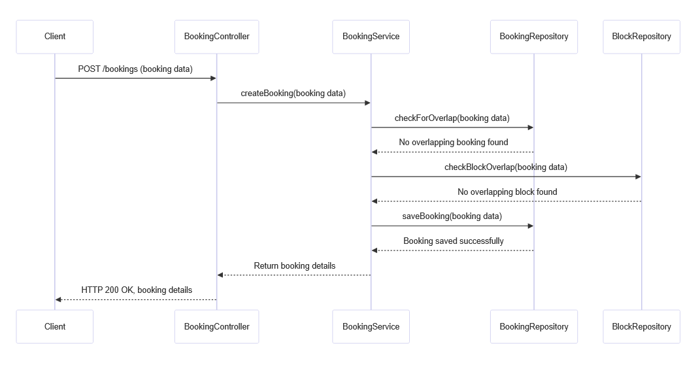

# 📅 Booking Service

Booking-Service is a microservice for managing bookings and blocks. It provides RESTful endpoints to create, update, cancel, rebook, and delete bookings, as well as to create, update, and delete blocks, ensuring that no overlapping reservations occur.

## Features

- **Booking Management:** Create, update, cancel, rebook, and delete bookings.
- **Block Management:** Define blocks to prevent overlapping reservations.
- **RESTful API:** Follows REST architectural style.
- **In-memory Database:** Uses H2 database for development and testing.

## Architecture

The project follows a typical Spring Boot microservices structure with separation into controllers, services, repositories, and domain models.

### Sequence Diagram

Below is the sequence diagram illustrating the booking process:



## Getting Started

### Prerequisites

- Java 21
- Maven (or use the Maven Wrapper included in the project)
- Docker

### Building the Project

You can build the project using Maven with the Maven Wrapper:

```bash
./mvnw clean package -DskipTests
```

### Running Tests

To run tests locally:

```bash
./mvnw test
```

## Docker

You can build and run the application using Docker.

### Build and Run

1. **Build the Docker Image:**

   ```bash
   docker build -t booking-service:latest .
   ```

2. **Run the Docker Container:**

   ```bash
   docker run -d -p 8080:8080 --name booking-service booking-service:latest
   ```

   The service will be available at [http://localhost:8080](http://localhost:8080).


3. **Stop the Container:**

   ```bash
   docker stop booking-service
   ```

4. **Remove the Container:**

   ```bash
   docker rm booking-service
   ```

## API Usage

(under construction)
